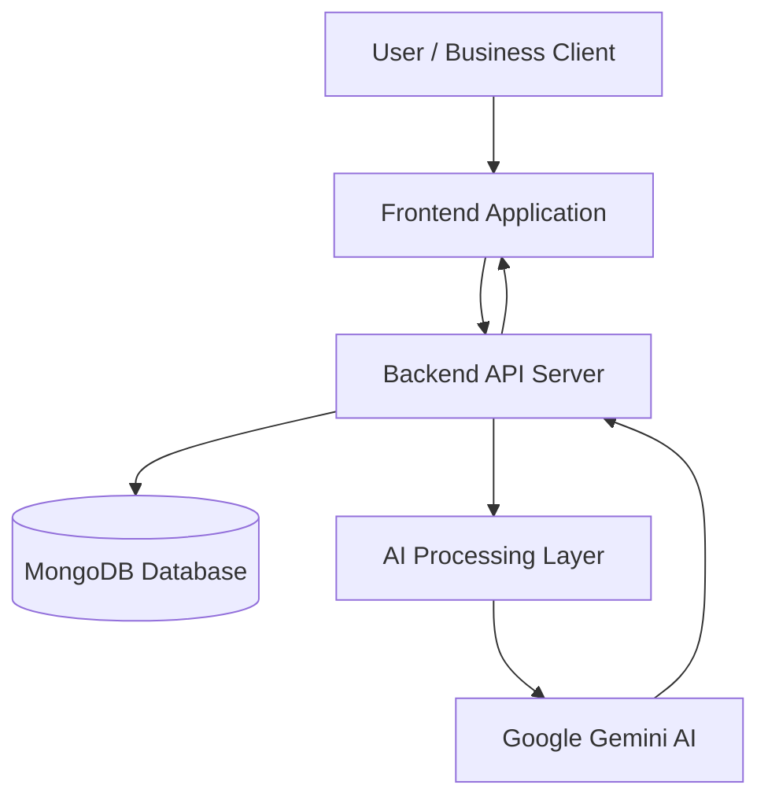
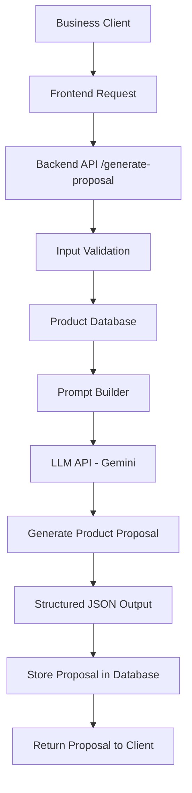
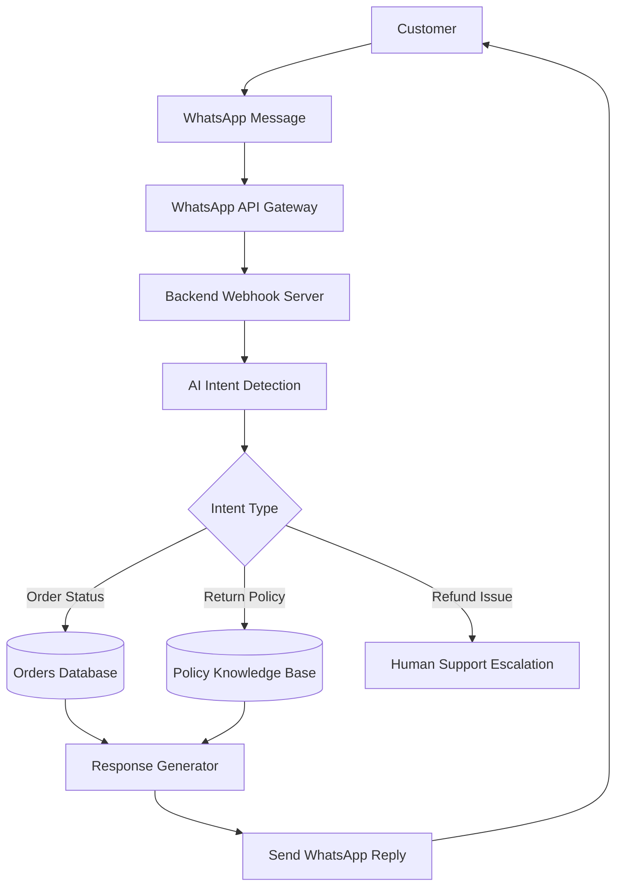

# 🌍 Rayeva AI Sustainable Commerce System

AI-powered modules designed for **sustainable commerce automation**.
This project demonstrates how modern AI systems can automate product categorization, environmental impact reporting, B2B proposal generation, and customer support.

Built as part of the **Rayeva AI Systems Assignment**, the system focuses on **production-ready AI integration, structured outputs, and clean architecture**.

---

# 🎯 Project Objective

Sustainable commerce platforms require intelligent automation to manage large product catalogs, generate environmental reports, and support customers efficiently.

This system introduces **AI-driven modules** to automate these tasks while ensuring **structured outputs, traceability, and scalable architecture**.

The project implements two modules fully and provides architecture design for the remaining modules.

---

# 🧩 Implemented Modules

## 1️⃣ AI Auto-Category & Tag Generator

Automatically categorizes sustainable products using AI.

### Key Features

* AI-powered product categorization
* SEO tag generation
* Sustainability filter detection
* Confidence scoring
* MongoDB storage
* AI telemetry logging

### Tech Stack

* React
* Tailwind CSS
* Node.js
* Express
* MongoDB
* Google Gemini AI

### Module Repository

Located in:

```
module1-auto-category-tag-generator
```

---

## 2️⃣ AI Impact Reporting Generator

Generates environmental impact reports for product purchases.

### Impact Metrics

* Plastic waste saved
* Carbon emissions avoided
* Local sourcing benefits

### Workflow

1. Retrieve product sustainability data
2. Calculate environmental metrics
3. Generate AI-based impact summary
4. Return structured JSON response

### Tech Stack

* Node.js
* Express
* MongoDB
* Gemini AI

### Module Repository

```
module3-impact-report-generator
```

---

# 🏗 System Architecture Overview



The architecture ensures **separation between AI processing, business logic, and database operations**, making the system scalable and maintainable.

---

# 📐 Architecture Modules (Design Only)

The following modules are **architecturally designed but not fully implemented**.

---

# 📊 Module 2: AI B2B Proposal Generator

Generates **sustainable product proposals for businesses** based on budget and sustainability goals.

### Inputs

* Business type
* Budget
* Sustainability preferences

Example:

```json
{
  "business_type": "restaurant",
  "budget": 50000,
  "preferences": ["compostable", "plastic-free"]
}
```

### Architecture



### Example Output

```json
{
 "proposal":[
   {
     "product_name":"Compostable Food Containers",
     "quantity":500,
     "cost":15000
   }
 ],
 "total_cost":27000,
 "impact_summary":"Switching to compostable containers reduces plastic waste significantly."
}
```

---

# 💬 Module 4: AI WhatsApp Support Bot

Provides automated customer support through WhatsApp.

### Features

* Order status queries
* Return policy explanations
* Refund escalation
* AI conversation logging

### Architecture



# 💻 Tech Stack

### Frontend

* React
* Tailwind CSS
* Vite
* React Router

### Backend

* Node.js
* Express.js

### Database

* MongoDB
* Mongoose

### AI Integration

* Google Gemini AI (`@google/genai`)

### Validation & Utilities

* Zod
* dotenv

---

# 📁 Repository Structure

```
rayeva-ai-sustainable-commerce-system
│
├── module1-auto-category-tag-generator
│
├── module3-impact-report-generator
│
├── architecture
│   ├── module2-b2b-proposal.md
│   └── module4-whatsapp-support-bot.md
│
└── README.md
```

---

# 🧠 AI Design Principles

The system is built around **structured AI outputs** to ensure reliability in production environments.

Key design principles:

* Strict JSON outputs from AI
* Prompt engineering for deterministic responses
* Logging of AI prompts and responses
* Clear separation of AI logic and business logic

---

# ⚙️ Environment Configuration

Each module requires its own environment configuration.

Example:

```
GEMINI_API_KEY=your_api_key
MONGODB_URI=your_mongodb_connection
PORT=5000
```

---

# 🚀 Running the Modules

Each implemented module runs independently.

Example:

### Start Backend

```
cd backend
npm install
npm run dev
```

### Start Frontend

```
cd frontend
npm install
npm run dev
```

---

# 🎥 Demo

A demo video demonstrates:

* AI product categorization
* Impact report generation
* System architecture overview

---

# 📌 Evaluation Criteria Alignment

This project addresses the assignment evaluation metrics:

| Criteria              | Implementation                  |
| --------------------- | ------------------------------- |
| Structured AI Outputs | JSON outputs enforced           |
| Business Logic        | Sustainability calculations     |
| Clean Architecture    | Modular backend design          |
| Practical Usefulness  | Real commerce use case          |
| Creativity            | AI + sustainability integration |

---

# 🔮 Future Improvements

Potential improvements include:

* Real lifecycle carbon footprint models
* Sustainable supplier recommendation AI
* Automated ESG reporting
* Sustainability analytics dashboards
* Full WhatsApp AI deployment

---

# 👨‍💻 Author

Developed as part of the **Rayeva AI Systems Internship Assignment**.

This project demonstrates **full-stack AI engineering, prompt design, sustainable commerce automation, and scalable architecture design**.
