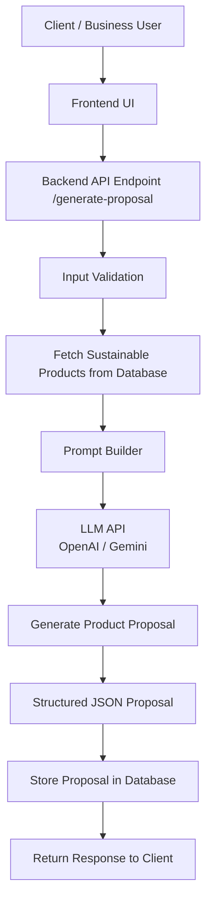

# Module 2: AI B2B Proposal Generator

## Overview

The AI B2B Proposal Generator automatically creates sustainable product proposals for business clients.  
It analyzes the business type, budget, and sustainability preferences to recommend a product mix that aligns with environmental goals.

The system uses AI to generate a structured proposal including recommended products, cost allocation, and sustainability impact.

---

## Inputs

The system receives the following inputs from the client application.

- Business type
- Budget
- Sustainability preferences

### Example Input

```json
{
  "business_type": "restaurant",
  "budget": 50000,
  "preferences": ["plastic-free", "compostable"]
}
```

---

## Processing Flow

1. Client sends request to backend API
2. Backend validates input data
3. Product database is queried
4. Prompt is generated for the AI model
5. LLM generates a product proposal
6. Proposal is returned in structured JSON
7. Proposal is stored in the database

---

## System Architecture Diagram



---

## AI Prompt Design

The prompt builder prepares a structured prompt for the AI model.

Example prompt:

```
You are an AI assistant that generates sustainable B2B product proposals.

Inputs:
Business Type: Restaurant
Budget: 50000
Preferences: Compostable, Plastic-Free

Tasks:
1. Suggest sustainable product mix
2. Allocate budget efficiently
3. Provide cost breakdown
4. Generate sustainability impact summary

Return the output as structured JSON.
```

---

## Example Output

```json
{
  "proposal": [
    {
      "product_name": "Compostable Food Containers",
      "quantity": 500,
      "cost": 15000
    },
    {
      "product_name": "Biodegradable Cutlery Set",
      "quantity": 1000,
      "cost": 12000
    }
  ],
  "total_cost": 27000,
  "remaining_budget": 23000,
  "impact_summary": "Switching to compostable containers can reduce plastic waste by approximately 120kg annually."
}
```

---

## Error Handling

The system includes validation and error handling mechanisms.

Possible errors handled:

- Invalid or missing budget
- Unsupported business type
- Empty product database
- AI response format errors
- API failures

The backend validates inputs before sending the request to the AI model.

---

## Benefits of the Architecture

- Clear separation of AI and business logic
- Scalable backend architecture
- Structured AI outputs
- Easy integration with product databases
- Supports sustainable commerce decision-making