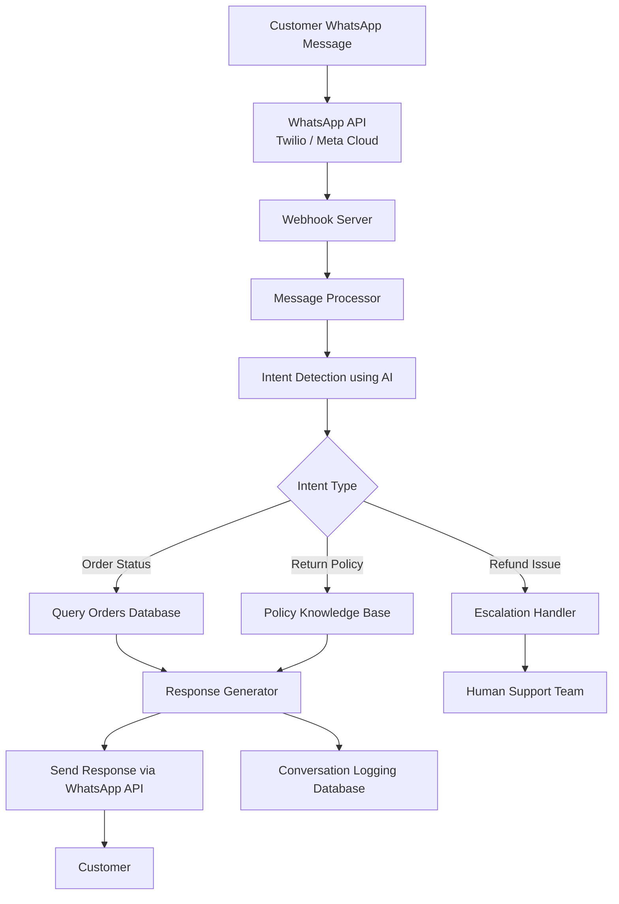

# Module 4: AI WhatsApp Support Bot

## Overview

The AI WhatsApp Support Bot provides automated customer support for the sustainable commerce platform.  
It allows customers to interact through WhatsApp to check order status, understand return policies, and escalate refund-related issues.

The system integrates WhatsApp APIs with backend services and an AI model to understand user queries and provide accurate responses using real database information.

---

## Key Features

- Answer order status queries
- Handle return policy questions
- Escalate refund or critical issues to human support
- Log AI conversations for monitoring and improvement

---

## Inputs

Customer messages received through WhatsApp.

### Example Input

```
Where is my order #10234?
```

---

## Processing Flow

1. Customer sends message on WhatsApp
2. WhatsApp API forwards the message to the backend webhook
3. Backend performs intent detection using AI
4. System determines the type of query
5. Relevant database information is retrieved
6. AI generates a response
7. Response is sent back to the customer
8. Conversation is logged for analytics

---

## System Architecture Diagram



---

## AI Intent Detection

The AI model analyzes incoming messages to determine user intent.

Example intents:

- Order Status Inquiry
- Return Policy Question
- Refund Request
- General Support Query

Example prompt used for intent detection:

```
Classify the following customer message into one of these categories:

1. Order Status
2. Return Policy
3. Refund Issue
4. General Support

Message:
"Where is my order #10234?"
```

---

## Example Response

Customer Message:

```
Where is my order #10234?
```

Bot Response:

```
Your order #10234 has been shipped and is expected to arrive tomorrow.
Tracking ID: TRK948382
```

---

## Error Handling

The system handles the following scenarios:

- Invalid order ID
- Missing order records
- AI model response errors
- WhatsApp API delivery failures

If the bot cannot answer confidently, the issue is escalated to human support.

---

## Benefits of the Architecture

- Real-time customer support through WhatsApp
- AI-powered intent detection
- Direct integration with order database
- Reduced manual support workload
- Improved customer experience