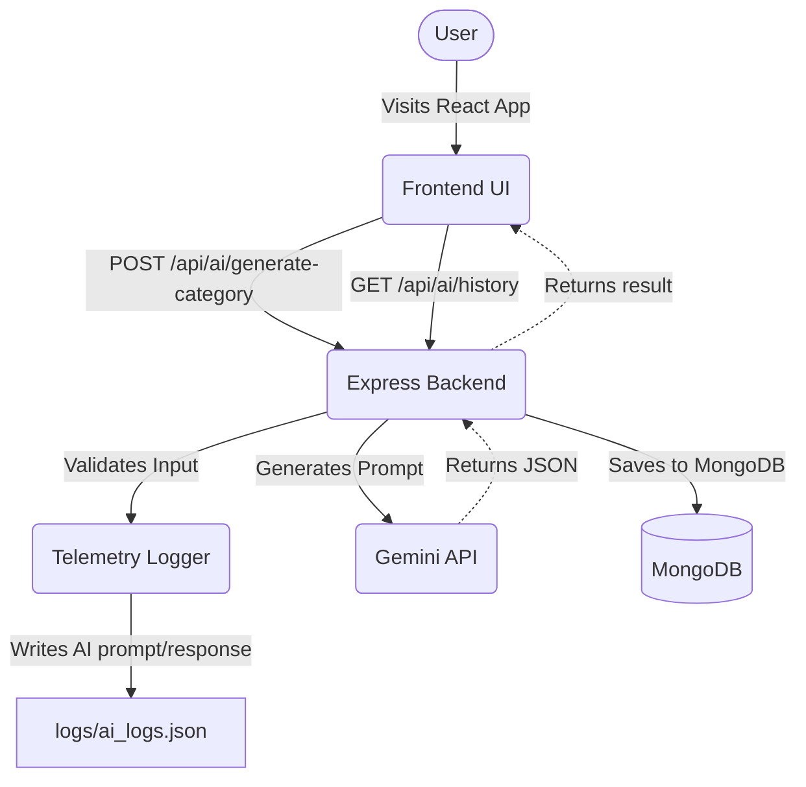

# AI Auto-Category & Tag Generator


An intelligent, full-stack application that leverages advanced AI to automatically categorize sustainable products. 
Given a product name and description, this system determines the optimal primary category, suggests a subcategory, generates SEO tags, identifies relevant sustainability filters, and provides a confidence score.

This project is built to demonstrate a **production-ready AI feature** suitable for a startup environment or an AI engineering internship assignment.

## 🚀 Features
- **AI-Powered Categorization:** Utilizes the cutting-edge `gemini-2.5-flash` model to analyze products.
- **Strict JSON Generation:** AI prompts are engineered to strictly output structured JSON data.
- **Automated Database Storage:** Every generated result is automatically saved to MongoDB via Mongoose.
- **Extensive AI Telemetry:** Complete logging of AI prompts, responses, and timestamps to `logs/ai_logs.json`.
- **Modern UI/UX:** Built with React and Tailwind CSS featuring dynamic badges, loading states, and confidence score progress bars.
- **History Tracking:** Dedicated `/history` route to review all past AI generations from the database.

## 🏗 Architecture Diagram


## 💻 Tech Stack
- **Frontend:** React, React Router, Tailwind CSS, Lucide Icons, Vite
- **Backend:** Node.js, Express.js
- **Database:** MongoDB, Mongoose
- **AI Integration:** Google Gen AI SDK (`@google/genai`)

## 🧠 AI Prompt Design Explanation
The system uses a highly structured prompt to enforce JSON output constraints. The prompt includes:
1. **Persona Injection**: *"You are an expert AI categorization assistant for a sustainable commerce platform."* - Contextualizes the AI.
2. **Strict Guidelines**: Explicitly defines the allowed enums for `Primary Category` and `Sustainability Filters`.
3. **JSON Structure Schema**: Provides the exact schema format it must output, and enforces strict JSON (using system instructions `responseMimeType: "application/json"`).
4. **Resiliency**: Built-in retry logic within the backend service to auto-retry if the AI hallucinates bad syntax.

## 🛠️ Setup Instructions

### 1. Clone & Install Dependencies
```bash
# Install backend dependencies
cd backend
npm install

# Install frontend dependencies
cd ../frontend
npm install
```

### 2. Configure Environment Variables
In the `backend` folder, create a `.env` file:
```env
PORT=5000
MONGO_URI=mongodb://localhost:27017/ai-ecommerce
GEMINI_API_KEY=your_gemini_api_key_here
```

### 3. Run the Application
Start the backend and frontend servers in separate terminals:
```bash
# Terminal 1: Start Backend (Runs on http://localhost:5000)
cd backend
npm run dev

# Terminal 2: Start Frontend (Runs on http://localhost:5173)
cd frontend
npm run dev
```

## 🔌 API Endpoints

### Generate Category
`POST /api/ai/generate-category`

**Request Body:**
```json
{
  "name": "Bamboo Toothbrush",
  "description": "Biodegradable bamboo toothbrush with recyclable packaging"
}
```

**Response:**
```json
{
  "success": true,
  "data": {
    "_id": "64b1f...",
    "name": "Bamboo Toothbrush",
    "description": "Biodegradable bamboo toothbrush with recyclable packaging",
    "category": "Personal Care",
    "subcategory": "Dental Care",
    "seo_tags": ["bamboo toothbrush", "eco-friendly dental care", "plastic-free"],
    "sustainability_filters": ["biodegradable", "plastic-free"],
    "confidence_score": 0.95,
    "createdAt": "2026-03-08T10:00:00.000Z"
  }
}
```

### Get History
`GET /api/ai/history`
Returns all historically generated items stored in the database.
