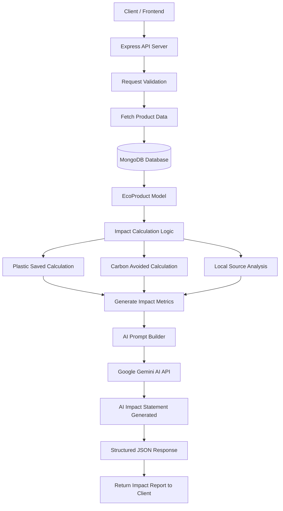

# 🌱 AI Impact Reporting Generator

An AI-powered backend module that calculates the **environmental impact of sustainable product purchases**.

The system estimates sustainability metrics such as:

- Plastic saved
- Carbon emissions avoided
- Local sourcing benefits

It then uses **Google Gemini AI** to generate a **human-readable environmental impact report**.

This module is designed for sustainable e-commerce platforms where businesses or customers purchase eco-friendly products.

---

# 🎯 Objective

The goal of this module is to **automatically generate sustainability impact reports** for product purchases.

When an order is placed, the system:

1. Retrieves product sustainability data from the database
2. Calculates environmental impact
3. Sends metrics to the AI model
4. Generates a human-readable sustainability report
5. Returns structured JSON output

This helps businesses communicate the **positive environmental impact of sustainable products**.

---

# 🏗 Architecture Diagram



---

# ⚙️ Tech Stack

### Backend
- Node.js
- Express.js

### Database
- MongoDB
- Mongoose

### AI
- Google Gemini API (`@google/genai`)

### Validation
- Zod

### Environment Configuration
- dotenv

---

# 📁 Project Structure

```
ai-impact-reporting-generator
│
├── backend
│   ├── server.js
│   ├── routes
│   │   └── index.js
│   │
│   ├── models
│   │   └── storage.js
│   │
│   ├── shared
│   │   ├── routes.js
│   │   └── schema.js
│   │
│   ├── utils
│   │   └── db.js
│   │
│   └── .env
│
├── frontend
│   ├── index.html
│   ├── package.json
│   └── src
│
└── README.md
```

---

# 🗄 Database Model

EcoProduct Schema

```javascript
{
  name: String,
  plastic_saved_per_unit: Number,
  carbon_saved_per_unit: Number,
  source: String
}
```

### Example Product

```
Name: Compostable Food Container
Plastic Saved per Unit: 50g
Carbon Saved per Unit: 0.12kg
Source: Local Manufacturer
```

---

# 📊 Impact Calculation Logic

The environmental impact is calculated using simple sustainability metrics.

### Plastic Saved

```
plastic_saved = plastic_saved_per_unit × quantity
```

### Carbon Emissions Avoided

```
carbon_avoided = carbon_saved_per_unit × quantity
```

These calculated values are passed to the AI model to generate the final sustainability report.

---

# 📥 Example API Request

Endpoint

```
POST /impact-report
```

Request Body

```json
{
  "productId": "69ad08b0b11ba88289142697",
  "quantity": 10
}
```

---

# 📤 Example API Response

```json
{
  "product_name": "Compostable Food Container",
  "quantity": 10,
  "plastic_saved_g": 500,
  "carbon_avoided_kg": 1.2,
  "source": "Local Manufacturer",
  "impact_statement": "This purchase prevented 500g of plastic waste and avoided 1.2kg of carbon emissions while supporting sustainable local production."
}
```

---

# 🤖 AI Prompt Design

The system sends sustainability metrics to the **Gemini AI model** to generate a human-readable impact statement.

Example prompt:

```
You are a sustainability analyst.

Generate a short environmental impact statement using the following data.

Plastic Saved: 500g
Carbon Avoided: 1.2kg
Source: Local Manufacturer

Explain the environmental benefit clearly for a customer.
```

The AI returns a short sustainability message describing the environmental benefits.

---

# 🔑 Environment Variables

Create a `.env` file inside the backend folder.

```
GEMINI_API_KEY=your_gemini_api_key
MONGODB_URI=your_mongodb_connection_string
PORT=5000
```

---

# 🚀 How to Run

Because the applications are **entirely decoupled**, they must be run in **separate terminal tabs/instances**.

---

## 1️⃣ Starting the Backend API

The backend must run for the frontend to communicate with it.  
It serves requests on **port 5000 by default**.

Look out for the setup configuration in:

```
backend/.env
```

Run:

```
cd backend
npm install
npm run dev
```

---

## 2️⃣ Starting the Frontend UI

The UI is built with **Vite**.

Running the development server will **proxy any `/api/*` calls** to the backend server running on port **5000**.

Run:

```
cd frontend
npm install
npm run dev
```

---

## 🌐 Access the Application

Open the frontend in your browser using the **Local URL printed in the console**, typically:

```
http://localhost:5173/
```

---

# 📝 Logging

The system can log:

- AI prompts
- AI responses
- Generated impact reports

This helps debug AI outputs and monitor system behavior.

---

# ⚠️ Error Handling

The API includes validation for:

- Invalid product IDs
- Missing request fields
- Database lookup failures
- AI API errors

This ensures reliable and predictable system behavior.

---

# 🔮 Future Improvements

Potential enhancements include:

- Real carbon footprint datasets
- Advanced lifecycle analysis models
- Sustainability analytics dashboard
- Bulk order impact reporting
- Integration with e-commerce platforms

---

# 🎥 Demo

A short demo video demonstrates:

- API request flow
- Impact calculation
- AI-generated sustainability report
- JSON response output

---
